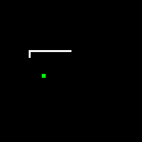

# Snake
A simple Java snake game applet. Inspired by original Atari game.

## Purpose

## Usage
This is a web applet, designed to be integrated into a website. Can work well in a loading screen or in lobbies / waiting rooms.

Aside from sizing & color otions, it also has a setting for wrap-around. Meaning that when enabled, the snake won't die when it hits the walls and instead will continue moving in from the adjacent wall. Settings are in Main.
